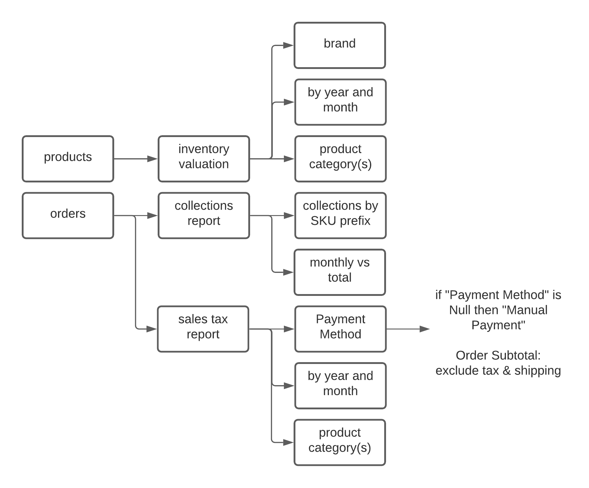

# TWL Reports
Programatically extracting data from BigCommerce for custom reports

## Table of Contents
- [Reports Summary](#reports-summary)
- [Notes](#notes)
- [Repo Tree](#repo-tree)

## Reports Summary
### (1) MONTHLY REPORT OF SALES FOR SALES TAX PURPOSES BY PAYMENT METHOD
- using [BigCommerce Orders v2 API](https://developer.bigcommerce.com/api-reference/store-management/orders/orders/getallorders) in BigCommOrdersAPI class

### (2) MONTHLY REPORTS FOR INVENTORY VALUATION
- using [BigCommerce Catalog/Products v3 API](https://developer.bigcommerce.com/api-reference/store-management/catalog/products/getproducts) in BigCommProductsAPI class


### (3) NEED A MONTHLY SALES REPORT BY CATEGORY or BY ITEM.
- using [BigCommerce Orders v2 API](https://developer.bigcommerce.com/api-reference/store-management/orders/orders/getallorders) in BigCommOrdersAPI class

Reports Breakout
[data source | report | data view / pivot table]


## Notes
```
main.py docstring

reports_list = ['inventory valuation','collections report','sales tax report']
main(): run reports list

Version 1:
- product and orders classes will pull information from api
- apply_filters method --> output: list of dataframes
- write_to_excel method

TODO:
- email reports
- add filter attributes to api calls
- github actions for autoformatting via black -l 120 src/

```

## Repo Tree

```bash
% tree --filelimit 9
.
├── LICENSE
├── README.md
├── notes
│   ├── 20210824_reports_email.md
├── reports_lineage.png
└── src
    ├── Untitled.ipynb
    ├── __init__.py
    ├── main.py
    ├── modules
    │ ├── bc_api_orders.py
    │ └── bc_api_product.py
    ├── project.cfg
    └── reports
        ├── inventory_reports.py
        └── orders_reports.py
```